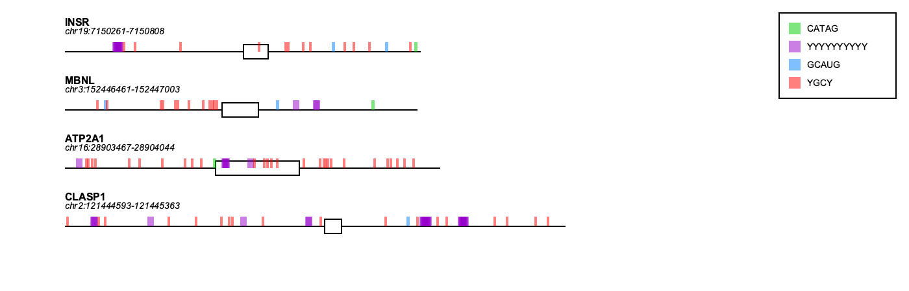

# motif-mark

A tool for identifying and visualizing motifs in DNA or pre-mRNA sequences. One output PNG is created, which includes one visualization per record in the FASTA. This PNG is named using the basename of the FASTA (e.g., fasta1.fa -> fasta1.png), and it will be created in the directory where the FASTA is located. 

## Usage:

`motif-mark-oop.py -f <FASTA> -m <MOTIF>`

`-f` : FASTA file with ≤ 10 records and ≤1000 bases per record. Each record should be an intron-exon-intron set. Introns should be represented as lowercase characters and exons as uppercase characters. Sequences must be free from gaps.

`-m` : Text file with one motif per line, ≤5 motifs total, and ≤10 bases per motif. Nucleotides must comply with [IUPAC naming conventions](https://genome.ucsc.edu/goldenPath/help/iupac.html). Motif sequences must be free from gaps.

## Requirements
[Pycairo v.1.29.0](https://github.com/pygobject/pycairo)

## Example Output

Example motif visualization:

[Example stats file](example_MotifStats.txt)
